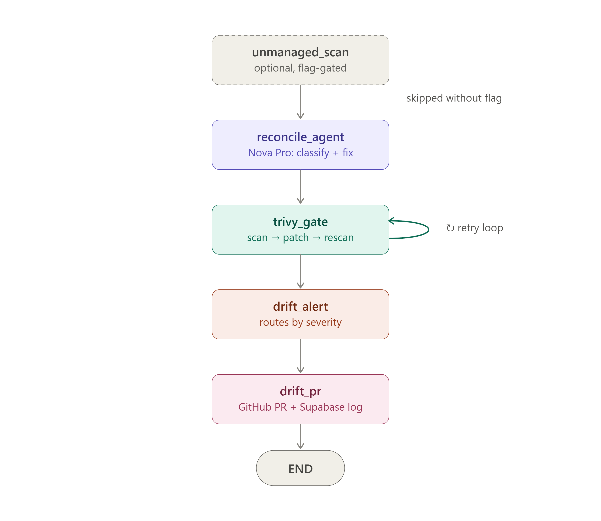
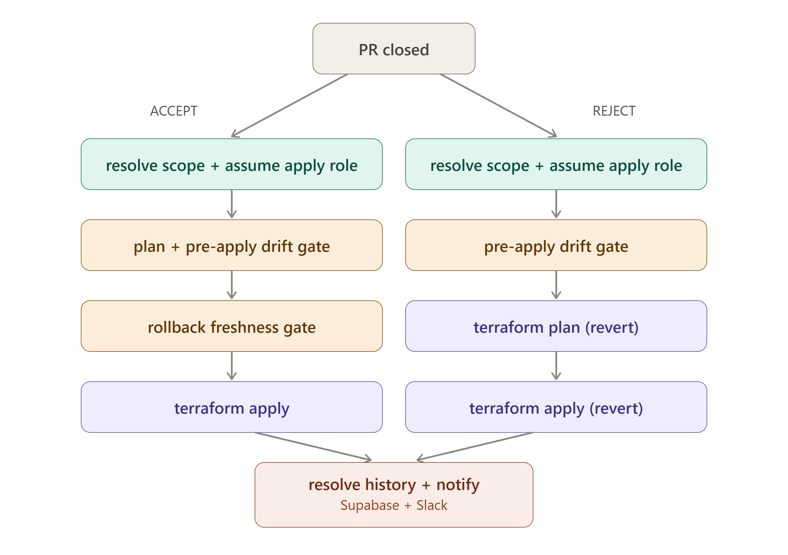

# AWS Terraform Drift Reconciler

An automated drift-detection pipeline that compares Terraform desired state against live AWS resources, classifies drift, proposes HCL fixes via an LLM agent, and opens GitHub pull requests for review. Supports multi-account/multi-region deployment, security scanning, cost estimation, unmanaged-resource detection, rollback, Slack/PagerDuty alerting, and historical trend reporting.

## Architecture

<p align="center">
  
</p>

<p align="center">
  
</p>

**Pipeline** (`drift_reconciler/agent.py`) — 5 LangGraph nodes in sequence
- `unmanaged_scan` (optional, `--scan-unmanaged`) — boto3 AWS enumeration
- `reconcile_agent` — Nova Pro classifies drift, proposes HCL fix
- `trivy_gate` — baseline scan → patch → scan → fix loop with pre-existing classification
- `drift_alert` — severity-routed: PagerDuty or Slack via configurable rules
- `drift_pr` — GitHub PR (fix/batch/rollback) + Supabase history append

**CLI** — `--rollback`, `--rollback-pr`, `--scan-unmanaged`, `--trends`, `--tf-dir`, `--account-label`, `--region`

**CI/CD** (`.github/workflows/`) — OIDC auth, scope-resolved, dual-gate (drift + freshness), auto-revert on block

---

## Features

### Core drift detection

| Feature | Status |
|---|---|
| Drift detection via `terraform plan -json` | ✅ |
| Multi-account / multi-region matrix | ✅ |
| GitHub OIDC-based AWS auth (scan role + apply role) | ✅ |
| PR creation with patched `.tf` file | ✅ |
| PR accept/reject workflow with `terraform apply` | ✅ |
| Scope-tagged PR branches, titles, and dedup keys | ✅ |
| `lifecycle.ignore_changes` / externally-managed resource handling | ✅ |
| Drift exceptions stored in Supabase (no more local JSON files) | ✅ |

### LLM agent

| Feature | Status |
|---|---|
| Amazon Nova Pro via Bedrock for analysis + fix proposals | ✅ |
| Remediation suggestions (HCL diff + plain-English summary) | ✅ |
| Cost-aware findings sorted by estimated monthly impact | ✅ |
| Skips LLM call when terraform plan fails (unmanaged-only mode) | ✅ |

### Security scanning

| Feature | Status |
|---|---|
| Trivy misconfiguration scan on proposed drift fixes | ✅ |
| Auto-fix loop (LLM patch → validate → re-scan) | ✅ |
| Pre-existing vs newly-introduced issue classification | ✅ |
| Baseline scan before patching to establish origin | ✅ |
| Human-review routing for CIDR/KMS/IAM decisions | ✅ |

### Unmanaged resource detection

| Feature | Status |
|---|---|
| boto3-based AWS enumeration (EC2, VPC, S3, DynamoDB, RDS, ElastiCache, etc.) | ✅ |
| Terraform state subtraction | ✅ |
| Classification (default / tagged-elsewhere / genuinely unmanaged) | ✅ |
| Unmanaged exceptions in Supabase with optional cost cap | ✅ |
| Integrated into agent pipeline behind `--scan-unmanaged` flag | ✅ |
| Continues when terraform plan fails (standalone AWS scan) | ✅ |

### Cost estimation

| Feature | Status |
|---|---|
| Static price cache (16 services, 4 regions) | ✅ |
| Per-resource hourly + monthly estimate | ✅ |
| 4-hour runtime window for accrued cost | ✅ |
| Cost surfaced in PR body, PagerDuty summary, Slack message | ✅ |
| `cost_impact` field on findings sorted by descending cost | ✅ |

### Alerting

| Feature | Status |
|---|---|
| PagerDuty (severity-routed, including rollback aborts) | ✅ |
| Slack incoming webhook (batched max 5/card) | ✅ |
| Workflow outcome → Slack (accept/reject/failure/rollback-blocked) | ✅ |
| Configurable severity routing via dashboard (HIGH/MEDIUM/LOW → PagerDuty/Slack) | ✅ |
| Routing rules stored in Supabase, configurable per scope | ✅ |
| PagerDuty/Slack credentials stored in Supabase (masked, service-role only) | ✅ |
| Test-alert button from dashboard | ✅ |
| All notification modules CI-safe (stdlib + `requests`, no dotenv dependency) | ✅ |

### Noise suppression

| Feature | Status |
|---|---|
| Drift exceptions with expiry, pattern matching, and optional `auto` flag | ✅ |
| Unmanaged exceptions with cost-cap threshold | ✅ |
| Auto-suppress rules for ASG-managed / AWS-managed drift (no human review needed) | ✅ |
| Direct Supabase CRUD from dashboard (add/expire/delete, no PR needed) | ✅ |
| Supabase-backed → pipeline reads exceptions at runtime, no local file dependency | ✅ |

### Patching

| Feature | Status |
|---|---|
| hcledit-based `.tf` patching for simple types (string, number, bool) | ✅ |
| Regex fallback when hcledit not available | ✅ |
| JSON-to-HCL converter for complex types (maps, lists, tags) | ✅ |
| Human-in-the-loop reviews every PR before merge | ✅ |

### Rollback

| Feature | Status |
|---|---|
| Baselines stored in Supabase (`changes_jsonb` column) — no local files needed | ✅ |
| `--rollback --rollback-pr <n>` CLI (reads from Supabase, works from any machine) | ✅ |
| Freshness gate at PR creation (checkpoint 1, always creates PR — warns if stale) | ✅ |
| Freshness gate at apply time (checkpoint 2, blocks apply + reverts merge if stale) | ✅ |
| PagerDuty on checkpoint-2 abort | ✅ |
| Self-similar rollback chain | ✅ |
| Rollback dashboard with live preview diff and polling | ✅ |

### CI/CD drift gate

| Feature | Status |
|---|---|
| Pre-apply check via `pre_apply_check.py` (reads Supabase for unresolved drift) | ✅ |
| `DRIFT_GATE_MODE` variable (`warn` or `block`) | ✅ |
| Blocked apply auto-reverts merge to keep code + AWS consistent | ✅ |
| Gate runs on both ACCEPT and REJECT paths | ✅ |
| Manual workflow_dispatch runs logged to Supabase history | ✅ |

### Historical drift store

| Feature | Status |
|---|---|
| Supabase PostgreSQL backend | ✅ |
| Append on drift detection, resolve on accept/reject | ✅ |
| `drift_trends.py` markdown report + Supabase RPC aggregation | ✅ |
| `--trends` flag on agent CLI | ✅ |
| Dashboard trends page with Chart.js (most-drifted, MTTR, daily volume, rollbacks, KPIs) | ✅ |
| MTTR with server-side aggregation + zero-fill for missing days | ✅ |

### IAM

| Feature | Status |
|---|---|
| Separate scan (read-only) and apply (write) roles per account | ✅ |
| OIDC trust scoped to GitHub environment (apply) or branch (scan) | ✅ |
| Inline policies with explicit `Describe*` / `Get*` read permissions for refresh | ✅ |
| Write policies scoped to managed resource prefixes (S3, DynamoDB) | ✅ |

### Dashboard

| Feature | Status |
|---|---|
| Live scan trigger with stage tracking (polling + Realtime) | ✅ |
| Drift findings explorer with filters, search, pagination | ✅ |
| Rollback UI with preview diff + confirmation polling | ✅ |
| Trends page with 4 Chart.js visualizations + KPI summary cards | ✅ |
| Exceptions management (add/expire/delete via Supabase CRUD) | ✅ |
| Alerts configuration (PagerDuty/Slack keys, severity routing, test send) | ✅ |
| Environments management (CRUD, git source, AWS credentials via UI) | ✅ |
| Responsive dark-theme design with shared site navigation | ✅ |
| 5-minute scan polling timeout with user-facing message | ✅ |
| Structured error display (summary, suggestion, expandable details) | ✅ |
| Shared environment selector component (`env-selector.js`) | ✅ |

### Environments & credentials

| Feature | Status |
|---|---|
| Environments table with full scope metadata (region, state bucket, IAM roles) | ✅ |
| AWS credential storage: profile / OIDC assume-role / static keys | ✅ |
| Masked secrets display (last 4 chars, never sent to frontend in full) | ✅ |
| Git clone source (repo URL, branch, auth) per environment | ✅ |
| Dynamic scope resolution from Supabase (add an environment → valid everywhere) | ✅ |
| Auth-type validation (keys requires both access key + secret key) | ✅ |
| AWS_PROFILE only set for profile-auth environments (prevents boto3 crash) | ✅ |

### Error handling & observability

| Feature | Status |
|---|---|
| `scan_runs` lifecycle tracking (running → complete/failed) in Supabase | ✅ |
| Terraform plan failure caught inside try/except (was pre-try `sys.exit(1)`) | ✅ |
| Unmanaged-only scan continues when terraform plan fails | ✅ |
| Human-readable error messages via `humanize_terraform_error()` pattern matching | ✅ |
| UTF-8 encoding on all subprocess calls (no mangled box-drawing characters) | ✅ |
| `-no-color` on all terraform commands + ANSI-strip defense-in-depth | ✅ |
| Stale-request guard in `refreshAll` (prevents rapid-tab-switch rendering races) | ✅ |
| Canvas lifecycle fix (recreate on empty → data transitions) | ✅ |

---

## Quick start

### Prerequisites

- Python 3.11+ with `requests`, `boto3`, `langchain-aws`, `langgraph`, `pygithub`
- Terraform CLI 1.9+
- Trivy (optional, for security scanning)
- hcledit (optional, for reliable `.tf` patching)
- Supabase project (for drift history, exceptions, routing rules, environments, secrets)

### Local run

```bash
# Drift detection only
python drift_reconciler/agent.py --tf-dir terraform_code/ec2_terraform_account_a --account-label scope-a --region us-east-1

# With unmanaged resource scan
python drift_reconciler/agent.py --tf-dir terraform_code/ec2_terraform_account_a --account-label scope-a --region us-east-1 --scan-unmanaged

# Rollback a previous fix
python drift_reconciler/agent.py --tf-dir terraform_code/ec2_terraform_account_a --account-label scope-a --region us-east-1 --rollback --rollback-pr 50

# Trend report
python drift_reconciler/agent.py --trends --trends-account scope-a
```

### Dashboard

```bash
python dashboard/serve.py --port 8080
```

Visit `http://localhost:8080` — 8 pages with shared navigation:
- **Dashboard** — live KPI cards (drift, cost, rollbacks, last scan)
- **Explorer** — searchable/filterable findings table with pagination
- **Scan** — trigger scans with stage tracking and structured error display
- **Rollback** — preview rollback diffs, confirm revert PRs
- **Trends** — Chart.js visualizations (most-drifted, MTTR, daily volume, KPIs)
- **Exceptions** — Supabase-backed drift/unmanaged exception CRUD
- **Alerts** — PagerDuty/Slack credential management + severity routing rules
- **Environments** — scope metadata, AWS credentials, git source configuration

### Environment

Copy `.env.example` to `.env` and configure:

| Variable | Purpose |
|---|---|
| `SUPABASE_URL` / `SUPABASE_SERVICE_ROLE_KEY` | Database backend |
| `SUPABASE_ANON_KEY` | Dashboard read access |
| `GITHUB_TOKEN` / `GITHUB_REPO` | PR creation |
| `PAGERDUTY_ROUTING_KEY` | PagerDuty alerts (legacy — can be managed via dashboard) |
| `SLACK_WEBHOOK_URL` | Slack notifications (legacy — can be managed via dashboard) |
| `AWS_REGION` | Default region |
| `DRIFT_CLONE_BASE` | Git clone directory (default: `~/.drift-clones`) |

### GitHub Actions

Two workflows handle PR lifecycle:

- `drift-preview.yml` — posts `terraform plan` output as a PR comment on `pull_request: [opened, synchronize]`
- `drift-reconciler.yml` — on `pull_request: [closed]`, runs `terraform apply` (accepted) or revert (rejected), resolves drift history, posts Slack notification

Required GitHub Secrets: `SCOPE_A_APPLY_ROLE_ARN` / `SCOPE_B_APPLY_ROLE_ARN`, `PROD_A_REGION` / `PROD_B_REGION` (Variables), `PAGERDUTY_ROUTING_KEY`, `SLACK_WEBHOOK_URL`, `SUPABASE_URL`, `SUPABASE_SERVICE_ROLE_KEY`.

---

## Supabase tables

| Table | Purpose |
|---|---|
| `drift_events` | Per-finding event log (resource, severity, PR, status, changes JSONB) |
| `scan_runs` | Pipeline invocation tracking (status, stages, results) |
| `rollback_runs` | Rollback invocation tracking |
| `notification_secrets` | Singleton: PagerDuty key + Slack webhook (service-role only) |
| `severity_routing_rules` | HIGH/MEDIUM/LOW → PagerDuty/Slack routing |
| `drift_exception_registry` | Drift + unmanaged exception entries (anon-readable) |
| `environments` | Scope metadata, AWS credentials, git source |
| `environment_secrets` | Per-environment secrets (AWS keys, GitHub token, service-role only) |

## Project structure

```
drift_reconciler/
  agent.py                    # LangGraph pipeline entrypoint
  trivy_agent.py              # Trivy scan → fix → scan loop
  github_integration.py       # PR creation, hcledit/regex .tf patching
  pagerduty_alert.py          # PagerDuty Events API
  slack_notify.py             # Slack Block Kit webhook
  workflow_notify.py          # Workflow outcome → Slack
  drift_history.py            # Supabase drift event log
  drift_trends.py             # Markdown trend report generator
  drift_migrate.py            # Local JSONL / baselines → Supabase migration
  rollback_check.py           # Checkpoint-2 freshness gate
  pre_apply_check.py          # CI/CD pre-apply drift gate (warn/block)
  unmanaged_scanner.py        # boto3 AWS resource enumeration
  formatting_drift_json.py    # terraform plan JSON → drift report
  notification_config.py      # Supabase-backed notification secrets CRUD
  environment_credentials.py  # AWS session resolver (profile/role/keys)
  scan_runs.py                # Scan lifecycle tracking in Supabase
  rollback_runs.py            # Rollback lifecycle tracking in Supabase
  cost_cache.json             # Static on-demand hourly rates

dashboard/
  serve.py                    # ThreadingHTTPServer (8 pages, REST APIs)
  index.html / dashboard.js   # Live KPI dashboard
  explorer.html / explorer.js # Drift findings explorer
  scan.html                   # Scan trigger + stage tracker
  rollback.html / rollback.js # Rollback preview + confirm
  trends.html / trends.js     # Chart.js visualizations
  exceptions.html / exceptions.js # Exception CRUD
  alerts.html / alerts.js     # Notification settings + routing
  environments.html / environments.js # Environment management
  env-selector.js             # Shared dynamic scope selector
  styles.css                  # Dark-theme responsive stylesheet

terraform_code/
  ec2_terraform_account_a/    # scope-a terraform root
  ec2_terraform_account_b/    # scope-b terraform root
  account-a/                  # scope-a IAM bootstrap (scan + apply roles)

migrations/
  create_scan_runs_table.sql
  create_rollback_runs_table.sql
  create_drift_severity_summary_view.sql
  create_exception_registry_table.sql
  create_notification_secrets_table.sql
  create_severity_routing_rules_table.sql
  create_environments_table.sql
  create_scope_config_table.sql
  create_trends_rpc_functions.sql
  add_aws_credentials_to_environments.sql
  add_git_source_to_environments.sql
  add_pr_review_columns_drift_events.sql
  add_rolled_back_from_pr_column.sql
  enable_rls_drift_events.sql

.github/workflows/
  drift-preview.yml           # PR plan preview
  drift-reconciler.yml        # PR accept/reject, rollback gate, notify
```
